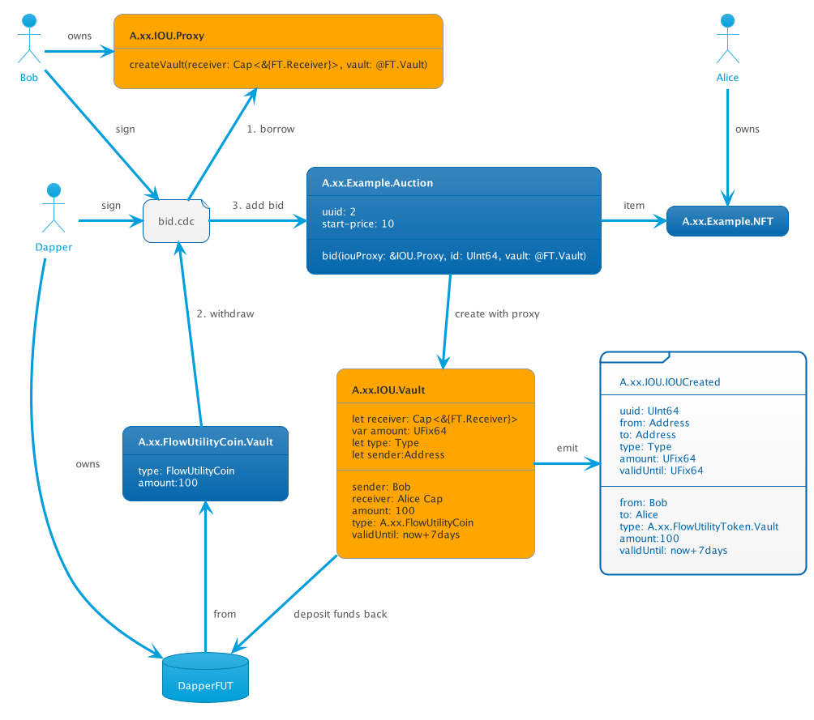

# IOU

An IOU is a promise that a sender will send X amount of FT to a recipient.  

The core concept here is an *IOU*. It has the following semantics
 - an IOU is created from a resource stored in a users storage (to guarantee sender)
 - an IOU has the capablity to a receiver that is **immutable**, this guarnatees that the funds will **always** go to the intended receipient. It cannot be transferred to another user.
 - an IOU has a Type that corresponds to the DUC/FUT vaults
 - an IOU has an amount that can be updated since an IOU can be topped up
 - an IOU has an expiry date, the IOU contract will guarnatee that withdraw after this amount will panic and fail

See the following diagrams for an example flow
## Diagrams

Taxonomy:
 - blue rectangles are resources
 - orange rectangle is the new resource beeing proposed
 - white folders are events
 - white files are transactions
 - people are accounts
 - blue databases are vaults

The diagrams are added to the repo as PUML files written in https://plantuml.com/deployment-diagram syntax. Preview using VScode.

### Bob offers 100 FUT to Alice NFT

### Bob increases bid with 10 FUT

### Alice Fulfills the Auction

### Alice cancels the auction (alternate)

## Intended Usecase

Any solution that wants to reason about the guarnatee that an user has funds on Dapper Wallet. 
Examples:
 - Offers (both Direct and Global)
 - Auctions( both English, Dutch, Vickrey, Bucket)
 - Loans/Flowty
 
 ## What needs to be done off chain
 
 In order for this to work there needs to be an accounting solution that knows how to reason about the *IOU.IOUxxx* events that are emitted. 
 In adition there needs to be a routine that checks if IOUs are expired.
 
